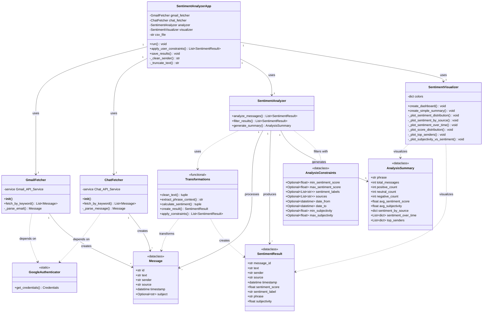

# 📊 Gmail & Google Chat Sentiment Analyzer

A comprehensive sentiment analysis tool that searches Gmail and Google Chat messages for specific phrases, analyzes sentiment polarity and subjectivity, and generates detailed visualizations and reports.


---

## 📑 Table of Contents

- [Overview](#overview)
- [Features](#features)
- [Architecture](#architecture)
- [Installation](#installation)
- [Configuration](#configuration)
- [Usage](#usage)
- [Project Structure](#project-structure)
- [Technical Details](#technical-details)
- [Constraints & Filtering](#constraints--filtering)
- [Visualization](#visualization)
- [Examples](#examples)
- [Troubleshooting](#troubleshooting)
- [Contributing](#contributing)
- [License](#license)

---

## 🎯 Overview

This application analyzes sentiment in Gmail and Google Chat messages containing user-specified phrases. Unlike keyword-based sentiment analysis, it extracts context around phrases for more accurate analysis and provides both quantitative scores and qualitative insights.

### **What It Does**

1. **Searches** Gmail and Google Chat for messages containing a specific phrase
2. **Analyzes** sentiment (positive/negative/neutral) and subjectivity (fact/opinion)
3. **Filters** results based on user-defined constraints
4. **Visualizes** sentiment patterns through interactive dashboards
5. **Exports** results to clean CSV files

### **Use Cases**

- 📈 **Team Morale Analysis**: Track sentiment about "project deadline" or "team meeting"
- 🔍 **Customer Feedback**: Analyze mentions of "product launch" or "customer support"
- 📊 **Internal Communication**: Compare sentiment across Gmail vs. Chat platforms
- 🎯 **Trend Analysis**: Monitor sentiment changes over time
- 🤝 **Stakeholder Analysis**: Identify which senders are most positive/negative

---

## ✨ Features

### **Core Capabilities**

- ✅ **Phrase-Based Search**: Search for multi-word phrases, not just keywords
- ✅ **Context-Aware Analysis**: Extracts 10 words before/after phrase for focused sentiment
- ✅ **Dual Metrics**:
    - Sentiment Score (-1 to +1): Negative to Positive
    - Subjectivity Score (0 to 1): Objective to Subjective
- ✅ **Multi-Platform**: Analyzes both Gmail and Google Chat
- ✅ **Advanced Filtering**: 8 constraint types for precise results
- ✅ **Rich Visualizations**: 6-panel dashboard with multiple chart types
- ✅ **Clean Exports**: Professional CSV output with formatted data

### **Technical Features**

- 🔐 Secure OAuth 2.0 authentication
- 🔄 Automatic token refresh handling
- 📊 Statistical summaries (averages, distributions, trends)
- 🎨 Color-coded visualizations
- 📅 Time-series analysis (sentiment over time)
- 👥 Sender ranking by sentiment

---

## 🏗️ Architecture

### **Design Paradigm: Hybrid Functional-OOP**

The application uses a **hybrid architecture** combining:

- **OOP** for entities and API connections
- **Functional Programming** for data transformations
- **Pipeline Pattern** for data flow

```
┌─────────────────────────────────────────────────────────────┐
│                     USER INTERFACE                          │
│              (Command Line Interface)                       │
└───────────────────────┬─────────────────────────────────────┘
                        │
                        ▼
┌─────────────────────────────────────────────────────────────┐
│              APPLICATION LAYER (main.py)                    │
│         SentimentAnalyzerApp - Main Orchestrator            │
└─────┬──────────────────┬──────────────────┬──────────────── ┘
      │                  │                  │
      ▼                  ▼                  ▼
┌──────────┐    ┌──────────────┐    ┌─────────────┐
│ Fetchers │    │   Analyzer   │    │ Visualizer  │
│  (OOP)   │    │   (Hybrid)   │    │    (OOP)    │
└────┬─────┘    └──────┬───────┘    └──────┬──────┘
     │                 │                    │
     ▼                 ▼                    ▼
┌──────────┐    ┌──────────────┐    ┌─────────────┐
│  Gmail   │    │Transformations│   │   Charts    │
│   API    │    │  (Functional)│    │  & Graphs   │
└──────────┘    └──────────────┘    └─────────────┘
     │                 │                    │
     ▼                 ▼                    ▼
┌──────────┐    ┌──────────────┐    ┌─────────────┐
│  Chat    │    │   Models     │    │   Output    │
│   API    │    │ (Data Class) │    │ (CSV/PNG)   │
└──────────┘    └──────────────┘    └─────────────┘
```

### **Data Flow Pipeline**

```
User Input (Phrase)
    ↓
Fetch Messages (Gmail + Chat APIs)
    ↓
Extract Phrase Context (10 words around phrase)
    ↓
Clean Text (remove whitespace, normalize)
    ↓
Calculate Sentiment (TextBlob NLP)
    ↓
Apply Constraints (user filters)
    ↓
Generate Summary (statistics)
    ↓
Output (CSV + Visualizations)
```

---

## 📊 Class Diagram



---

## 🚀 Installation

### **Prerequisites**

- Python 3.8 or higher
- Google Account (Gmail)
- Google Cloud Project (for API credentials)

### **Step 1: Clone Repository**

```bash
git clone https://github.com/yourusername/sentiment-analyzer.git
cd sentiment-analyzer
```

### **Step 2: Create Virtual Environment**

```bash
# Windows
python -m venv venv
venv\Scripts\activate

# Mac/Linux
python3 -m venv venv
source venv/bin/activate
```

### **Step 3: Install Dependencies**

```bash
pip install -r requirements.txt
python -m textblob.download_corpora
```

### **Dependencies**

```
google-auth==2.23.0
google-auth-oauthlib==1.1.0
google-auth-httplib2==0.1.1
google-api-python-client==2.100.0
pandas==2.1.1
textblob==0.17.1
matplotlib==3.8.0
seaborn==0.13.0
```

---

## ⚙️ Configuration

### **Google Cloud Setup**

1. **Go to [Google Cloud Console](https://console.cloud.google.com/)**

2. **Create New Project**
    - Name: `sentiment-analyzer`
    - Click "Create"

3. **Enable APIs**
    - Navigate to "APIs & Services" → "Library"
    - Enable **Gmail API**
    - Enable **Google Chat API**

4. **Configure OAuth Consent Screen**
    - Select "External"
    - App name: `Sentiment Analyzer`
    - Add your email as test user
    - Add scopes:
        - `https://www.googleapis.com/auth/gmail.readonly`
        - `https://www.googleapis.com/auth/chat.messages.readonly`

5. **Create OAuth Credentials**
    - Go to "Credentials"
    - Click "Create Credentials" → "OAuth client ID"
    - Application type: **Desktop app**
    - Name: `Sentiment Analyzer Desktop`
    - Download JSON

6. **Save Credentials**
    - Rename downloaded file to `credentials.json`
    - Place in project root directory

### **⚠️ Security Notes**

- **NEVER** commit `credentials.json` or `token.json` to Git
- These files are already in `.gitignore`
- Keep credentials secure and private

---

## 💻 Usage

### **Basic Usage**

```bash
python main.py
```

### **Interactive Workflow**

```
1. Enter phrase to search: "project deadline"

2. System fetches messages from Gmail and Chat

3. Apply constraints (optional):
   - Filter by sentiment: negative
   - Filter by source: [Enter to skip]
   - Minimum score: -0.5
   - Maximum score: [Enter to skip]
   - Minimum subjectivity: [Enter to skip]

4. View text summary

5. Generate visualizations: yes

6. Files created:
   - results.csv
   - sentiment_analysis_project_deadline_20240306_143022.png
```

### **Example Session**

```
Enter phrase to search: team morale

🔍 Searching for 'team morale'...
📧 Fetching Gmail messages...
💬 Fetching Google Chat messages...
✅ Found 18 messages (15 Gmail, 3 Chat)
🤖 Analyzing sentiment...

🎛️  Apply constraints? (press Enter to skip)
  Filter by sentiment: [Enter]
  Filter by source: [Enter]
  Minimum sentiment score: [Enter]
  Maximum sentiment score: [Enter]
  Minimum subjectivity: 0.5

✅ Filtered: 18 → 12 messages
💾 Results saved to results.csv

======================================================================
SENTIMENT ANALYSIS MATRIX: 'team morale'
======================================================================

📊 OVERALL STATISTICS:
   Total Messages: 12
   Average Sentiment: 0.425 (-1 to +1)
   Average Subjectivity: 0.712 (0 to 1)

🎯 SENTIMENT BREAKDOWN:
   ✅ Positive: 8 (66.7%)
   ⚪ Neutral:  2 (16.7%)
   ❌ Negative: 2 (16.7%)

Would you like to see visualizations? (yes/no): yes

📊 Generating visualizations...
📊 Visualization saved as: sentiment_analysis_team_morale_20240306_143530.png
```

---

## 📁 Project Structure

```
sentiment-analyzer/
├── main.py                 # Application entry point
├── models.py               # Data classes (Message, SentimentResult, etc.)
├── fetchers.py             # Gmail & Chat API integration
├── analyzer.py             # Sentiment analysis pipeline
├── transformations.py      # Pure transformation functions
├── visualizer.py           # Chart and graph generation
├── requirements.txt        # Python dependencies
├── .gitignore             # Git ignore rules
├── README.md              # This file
│
├── credentials.json       # OAuth credentials (DO NOT COMMIT)
├── token.json            # OAuth token (DO NOT COMMIT)
│
└── Output Files/
    ├── results.csv                           # Analysis results
    └── sentiment_analysis_*.png              # Visualizations
```

---

## 🔬 Technical Details

### **Sentiment Analysis Algorithm**

Uses **TextBlob** - a lexicon-based NLP library:

1. **Tokenization**: Splits text into words
2. **Word Lookup**: Each word has pre-assigned polarity
3. **Aggregation**: Averages word scores
4. **Modifiers**: Adjusts for intensifiers ("very good") and negations ("not bad")

**Sentiment Score Scale:**

```
-1.0                    0.0                    +1.0
└────────────────────────┴────────────────────────┘
  Very Negative      Neutral           Very Positive

Classification:
  Score > 0.1   → Positive
  Score < -0.1  → Negative
  Otherwise     → Neutral
```

**Subjectivity Score Scale:**

```
0.0                    0.5                    1.0
└────────────────────────┴────────────────────────┘
  Pure Fact          Mixed         Pure Opinion

Examples:
  0.1: "Meeting is at 3pm"
  0.5: "Project looks good"
  0.9: "I absolutely love this!"
```

### **Context Extraction**

Instead of analyzing entire messages, the system:

1. Locates the search phrase
2. Extracts 10 words before + phrase + 10 words after
3. Analyzes only this context window
4. Results in more accurate phrase-specific sentiment

**Example:**

```
Full email: "The Q4 planning went well. The project deadline
            is concerning. However, team morale is excellent."

Search phrase: "project deadline"

Context extracted: "...planning went well. The project deadline
                   is concerning. However, team..."

Sentiment: Negative (-0.4)
(Focused on deadline, not morale)
```

---

## 🎛️ Constraints & Filtering

### **Available Constraints**

| Constraint              | Type            | Purpose                          | Example                           |
| ----------------------- | --------------- | -------------------------------- | --------------------------------- |
| **Sentiment Labels**    | Multiple choice | Show only specific sentiments    | `negative` or `positive,negative` |
| **Source**              | Multiple choice | Filter by platform               | `gmail` or `chat`                 |
| **Min Sentiment Score** | Float (-1 to 1) | Exclude messages below threshold | `0` (only neutral/positive)       |
| **Max Sentiment Score** | Float (-1 to 1) | Exclude messages above threshold | `-0.3` (only seriously negative)  |
| **Min Subjectivity**    | Float (0 to 1)  | Show only opinions/feelings      | `0.6` (exclude facts)             |
| **Max Subjectivity**    | Float (0 to 1)  | Show only factual messages       | `0.3` (exclude opinions)          |
| **Date From**           | Date            | Messages after this date         | _(Not yet implemented)_           |
| **Date To**             | Date            | Messages before this date        | _(Not yet implemented)_           |

### **Common Filter Patterns**

**Find Serious Problems:**

```
Sentiment: negative
Max Score: -0.4
```

**Find Emotional Reactions:**

```
Min Subjectivity: 0.7
```

**Compare Platforms:**

```
Source: gmail  (Run 1)
Source: chat   (Run 2)
```

---

## 📊 Visualization

### **6-Panel Dashboard**

The visualization dashboard includes:

1. **Sentiment Distribution (Pie Chart)**
    - Overall breakdown: Positive/Neutral/Negative
    - Percentage of each category

2. **Sentiment by Source (Stacked Bar)**
    - Compares Gmail vs. Chat
    - Shows sentiment composition per platform

3. **Sentiment Over Time (Line Chart)**
    - Monthly trend analysis
    - Tracks sentiment changes

4. **Score Distribution (Histogram)**
    - Frequency of sentiment scores
    - Shows distribution shape
    - Includes average line

5. **Top Senders (Horizontal Bar)**
    - Ranks senders by average sentiment
    - Color-coded: green (positive), red (negative)
    - Shows message count per sender

6. **Subjectivity vs Sentiment (Scatter Plot)**
    - X-axis: Sentiment score
    - Y-axis: Subjectivity
    - Color: Sentiment label
    - Reveals fact vs. opinion patterns

### **Graph Interpretation**

**Quadrant Analysis (Scatter Plot):**

```
Subjectivity
   1.0│     High Subj + Negative       High Subj + Positive
      │     (Emotional complaints)      (Enthusiastic praise)
   0.5│  ────────────────────────────────────────────────
      │     Low Subj + Negative         Low Subj + Positive
   0.0│     (Factual problems)          (Factual good news)
      └─────────────────────────────────────────────────
      -1.0              0.0              +1.0
                  Sentiment Score
```

---

## 💡 Examples

### **Example 1: Team Morale Check**

**Goal:** Understand how team feels about deadlines

**Input:**

```
Phrase: "project deadline"
Constraints: min_subjectivity=0.5 (opinions only)
```

**Output:**

```
Total: 15 messages
Positive: 3 (20%) - "Excited about the deadline!"
Neutral: 4 (27%) - "Deadline is next week"
Negative: 8 (53%) - "Stressed about deadline"

Average Score: -0.28 (slightly negative)
Average Subjectivity: 0.72 (mostly opinions)

Insight: Team is stressed (53% negative, emotional)
Action: Consider deadline extension or support
```

### **Example 2: Communication Style Comparison**

**Goal:** Compare formality across platforms

**Run 1 - Gmail:**

```
Source: gmail
Average Subjectivity: 0.35 (factual)
Sentiment: -0.15 (slightly negative)
```

**Run 2 - Chat:**

```
Source: chat
Average Subjectivity: 0.68 (opinionated)
Sentiment: 0.12 (slightly positive)
```

**Insight:** Gmail more formal/negative, Chat more casual/positive

---

## 🐛 Troubleshooting

### **Common Issues**

#### **1. `RefreshError: invalid_grant`**

**Cause:** OAuth token expired or corrupted

**Fix:**

```bash
# Delete token and re-authenticate
del token.json  # Windows
rm token.json   # Mac/Linux

python main.py  # Re-run, browser will open
```

#### **2. `FileNotFoundError: credentials.json`**

**Cause:** OAuth credentials not downloaded

**Fix:**

1. Download credentials from Google Cloud Console
2. Rename to `credentials.json`
3. Place in project root

#### **3. No messages found**

**Cause:** Phrase doesn't exist in messages or search is too specific

**Fix:**

- Try broader phrases: "deadline" instead of "project deadline Q4"
- Check spelling
- Try single keywords first

#### **4. Visualization not showing**

**Cause:** Matplotlib backend issue

**Fix:**

```python
# Add to top of visualizer.py
import matplotlib
matplotlib.use('TkAgg')  # or 'Qt5Agg'
```

#### **5. `ModuleNotFoundError`**

**Cause:** Dependencies not installed

**Fix:**

```bash
pip install -r requirements.txt
python -m textblob.download_corpora
```

---

## 🤝 Contributing

Contributions are welcome! Please follow these guidelines:

1. **Fork** the repository
2. **Create** a feature branch (`git checkout -b feature/AmazingFeature`)
3. **Commit** your changes (`git commit -m 'Add AmazingFeature'`)
4. **Push** to the branch (`git push origin feature/AmazingFeature`)
5. **Open** a Pull Request

### **Development Setup**

```bash
# Install dev dependencies
pip install -r requirements-dev.txt

# Run tests
pytest tests/

# Check code style
flake8 .
black .
```

---

## 📜 License

This project is licensed under the MIT License - see the [LICENSE](LICENSE) file for details.

---

## 🙏 Acknowledgments

- **TextBlob** for NLP sentiment analysis
- **Google APIs** for Gmail and Chat integration
- **Matplotlib/Seaborn** for visualizations
- **Pandas** for data manipulation

---

## 📞 Contact

**Project Maintainer:** Your Name

- Email: your.email@example.com
- GitHub: [@yourusername](https://github.com/yourusername)
- LinkedIn: [Your LinkedIn](https://linkedin.com/in/yourprofile)

---

## 🗺️ Roadmap

### **Planned Features**

- [ ] Multi-language support (non-English sentiment)
- [ ] Advanced ML models (BERT, GPT-based sentiment)
- [ ] Real-time monitoring dashboard
- [ ] Email notifications for sentiment alerts
- [ ] Custom sentiment dictionaries
- [ ] Slack integration
- [ ] Microsoft Teams integration
- [ ] Date range filtering (implementation)
- [ ] Export to PowerPoint
- [ ] API endpoint (REST API)

### **Version History**

- **v1.0.0** (Current)
    - Initial release
    - Phrase-based analysis
    - Gmail & Chat integration
    - 6-panel visualization
    - Constraint filtering

---

## 📊 Sample Output

### **CSV Export**

```csv
Date,Time,Source,Sender,Phrase,Sentiment,Score,Subjectivity,Message Preview
2024-03-06,14:30:22,GMAIL,john@company.com,deadline,Negative,-0.45,0.68,The project deadline is very tight and concerning...
2024-03-06,15:12:05,CHAT,sarah@company.com,deadline,Positive,0.62,0.75,Great work on meeting the deadline! Team is doing amazing...
```

### **Text Summary**

```
======================================================================
SENTIMENT ANALYSIS MATRIX: 'project deadline'
======================================================================

📊 OVERALL STATISTICS:
   Total Messages: 25
   Average Sentiment: -0.185 (-1 to +1)
   Average Subjectivity: 0.612 (0 to 1)

🎯 SENTIMENT BREAKDOWN:
   ✅ Positive: 6 (24.0%)
   ⚪ Neutral:  7 (28.0%)
   ❌ Negative: 12 (48.0%)

📍 BY SOURCE:
   GMAIL:
      Positive: 4 (20.0%)
      Neutral:  5 (25.0%)
      Negative: 11 (55.0%)
   CHAT:
      Positive: 2 (40.0%)
      Neutral:  2 (40.0%)
      Negative: 1 (20.0%)

👥 TOP 5 SENDERS:
   1. alice@company.com
      Avg Sentiment: 0.520 | Messages: 3
   2. bob@company.com
      Avg Sentiment: 0.180 | Messages: 5
   3. charlie@company.com
      Avg Sentiment: -0.220 | Messages: 4
```
